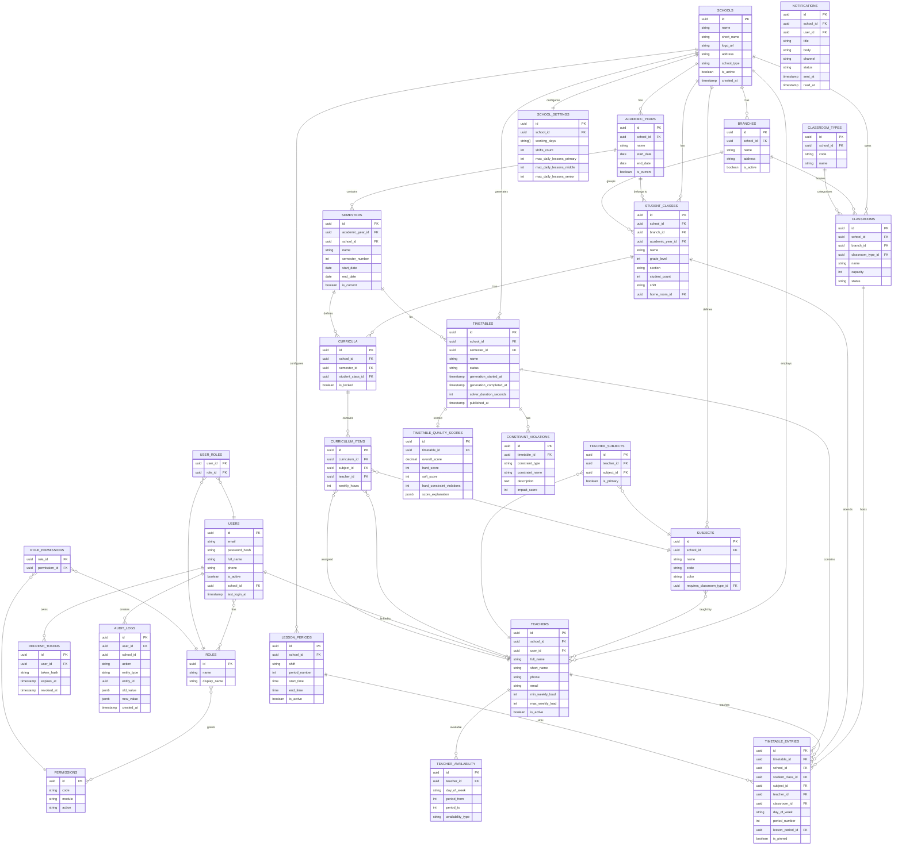

# ER Diagram
## Smart School Timetable Management and Optimization System

---

## Entity Relationship Diagram (Mermaid)



---

## Key Relationships Summary

| Relationship | Type | Description |
|---|---|---|
| School → Branch | 1:N | School has multiple branches |
| School → AcademicYear | 1:N | School has multiple academic years |
| AcademicYear → Semester | 1:N | Year has 2 semesters |
| School → Classroom | 1:N | School owns classrooms |
| School → Teacher | 1:N | School employs teachers |
| Teacher ↔ Subject | N:M | Teachers can teach multiple subjects |
| StudentClass → Curriculum | 1:1 per semester | Each class has one curriculum per semester |
| Curriculum → CurriculumItem | 1:N | Curriculum has items for each subject |
| Semester → Timetable | 1:N | Multiple timetable drafts per semester |
| Timetable → TimetableEntry | 1:N | Timetable contains lesson slots |
| TimetableEntry → {Class, Teacher, Classroom, Subject, Period} | N:1 each | Each entry references all resources |

---

## Integrity Constraints

```
Uniqueness Constraints:
├── (timetable_id, student_class_id, day_of_week, period_number) → UNIQUE
│     Prevents: class double-booking
├── (timetable_id, teacher_id, day_of_week, period_number) → UNIQUE
│     Prevents: teacher double-booking
├── (timetable_id, classroom_id, day_of_week, period_number) → UNIQUE
│     Prevents: room double-booking
├── (school_id, academic_year_id, class_name) → UNIQUE
│     Prevents: duplicate class names
└── (semester_id, student_class_id) → UNIQUE in curricula
      Prevents: duplicate curriculum per class/semester

Check Constraints:
├── grade_level BETWEEN 1 AND 11
├── semester_number IN (1, 2)
├── weekly_hours > 0
├── max_weekly_load >= min_weekly_load
└── start_date < end_date
```
